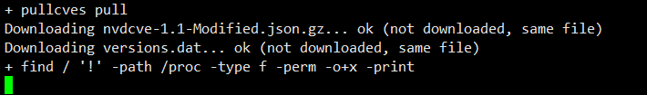

# cvechecker


```
Something I hope you know before go into the coding~
First, please watch or star this repo, I'll be more happy if you follow me.
Bug report, questions and discussion are welcome, you can post an issue or pull
a request.
```


```
The goal of cvechecker is to report about possible vulnerabilities on your
system, by scanning a list of installed software and matching results with the
CVE database.
This is not a bullet-proof method and you will have many false positives
(i.e.: vulnerability is fixed with a revision-release, but the tool isn't able
to detect the revision itself).
```

## 相关站点

* 官方源码：<https://github.com/sjvermeu/cvechecker>
* 官方文档：<https://github.com/sjvermeu/cvechecker/wiki>
* 安装指南：<https://github.com/sjvermeu/cvechecker/wiki/Installation>
* Fedora仓库：<https://src.fedoraproject.org/rpms/cvechecker>
* Fedora Bugz：<https://bugz.fedoraproject.org/cvechecker>


## 目录


* [cvechecker介绍](docs/cvechecker介绍.md)
* [cvechecker容器化部署](docs/cvechecker容器化部署.md)
    * [cvechecker容器化部署-fedora36](docs/cvechecker容器化部署-fedora36.md)
* [cvechecker使用](docs/cvechecker使用.md)
* [cvechecker源码分析](docs/cvechecker源码分析.md)


## 快速入门

```
#!/bin/bash

yum install -y cvechecker wget binutils libxslt

cvechecker -i

pullcves pull

find / ! -path /proc -type f -perm -o+x -print 2>/dev/null 1> scanlist.txt

echo /proc/version >> scanlist.txt

cvechecker -b scanlist.txt
cvechecker -r

echo "All done!"
```


## 图示




---
